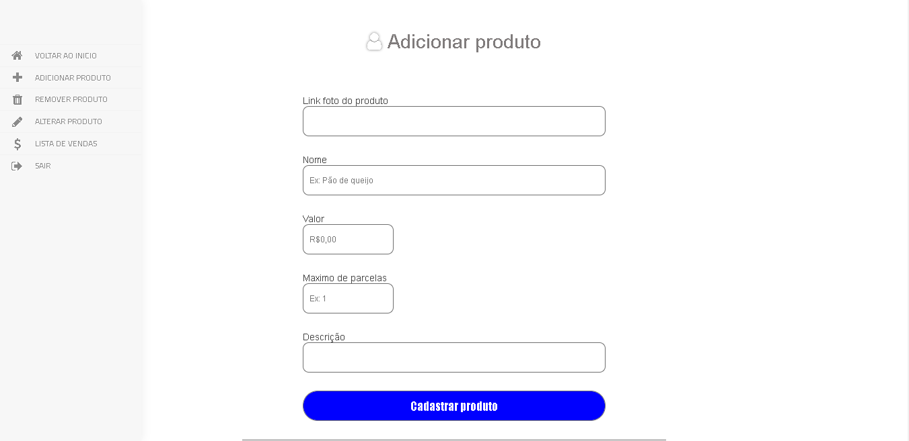
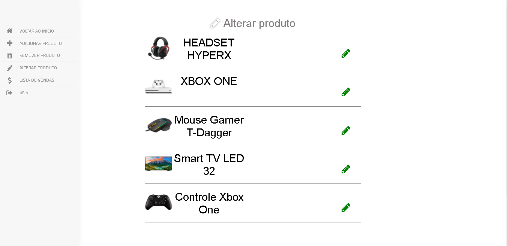
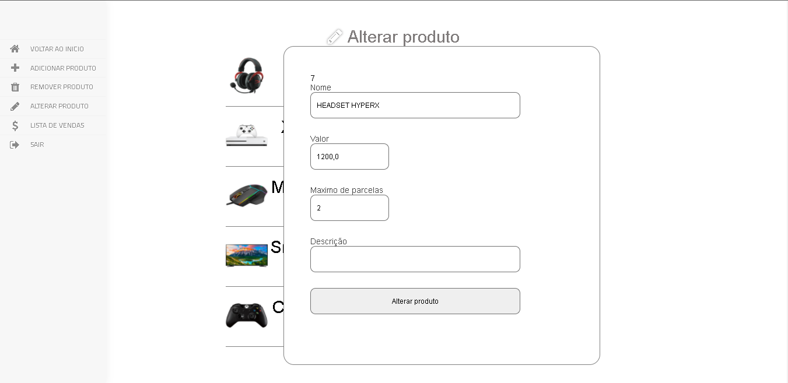
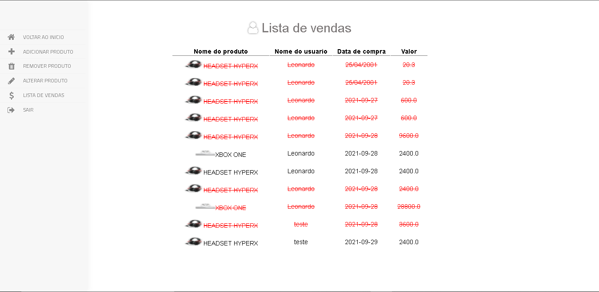
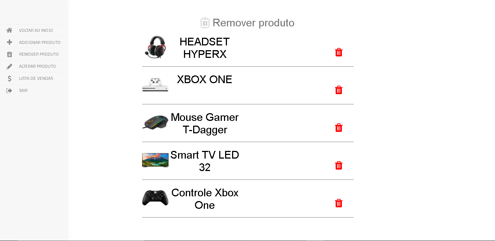
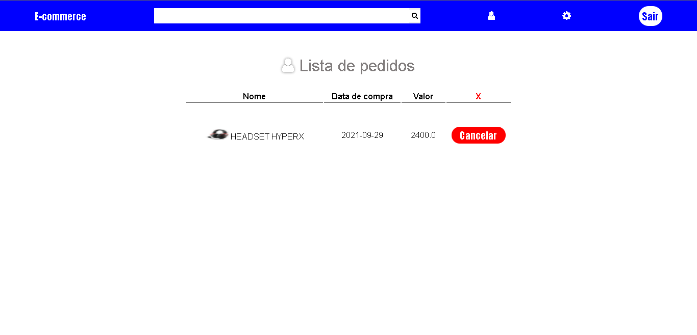

# Ecommerce-JSP
Buscando aprimorar minhas habilidades, achei um desafio onde teria que desenvolver um CRUD, utilizando como front-end HTML,CSS e Javascript e como back-end Java e Banco de Dados Mysql. Sendo possível buscar produto, realizar compra e cancelar compra, contendo no Painel Administrativo adicionar, remover e alterar produto e também listar todas as vendas realizadas no site. Tudo feito de forma fictícia.

<h2>Index</h2>

<h2>Busca de produto</h2>

<h2>Adicionar produto</h2>

<h2>Alterar produto</h2>

<h2>Alterar produto Popup</h2>

<h2>Lista de vendas</h2>

<h2>Remover produto</h2>

<h2>Compra</h2>

<h2>Pedidos</h2>

